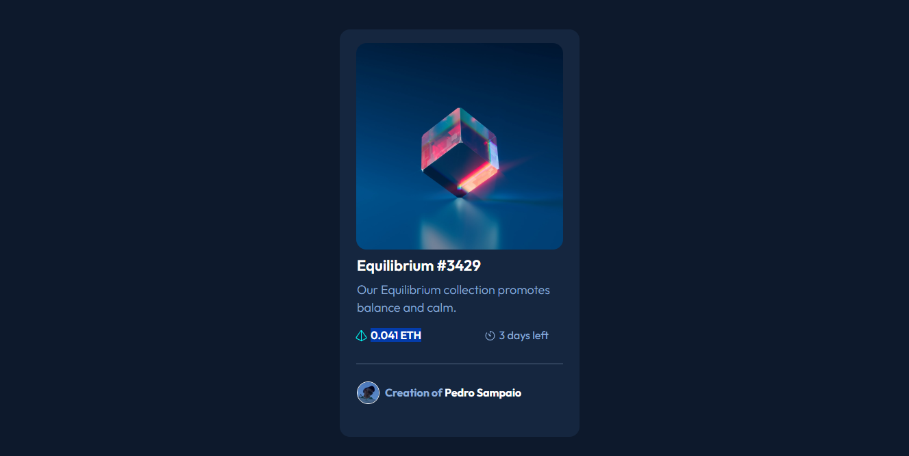
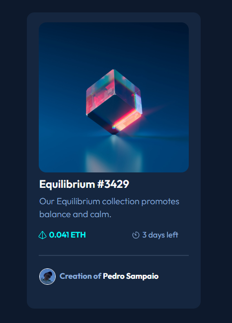

Card de Criptomoeda 📈💰
Este é um projeto desafio da comunidade Mantis Code no Discord, onde desenvolvi um card simples para exibir informações sobre uma criptomoeda específica usando HTML e CSS.

Funcionalidades ✨
Exibe informações básicas sobre uma criptomoeda.
Utiliza HTML para estruturar o card e CSS para estilizá-lo.
Tecnologias Utilizadas 🛠️
HTML
CSS

ℹ️ Como Utilizar
Clone o repositório: git clone https://github.com/PedroSampaio11/MantisCode-CSS-CARD
Abra o arquivo index.html em seu navegador web.

📷 Screenshots

### Visualização no desktop

### Visualização em dispositivo móvel

### Visualização com Cursor na Imagem

🤝 Contribuindo
Contribuições são bem-vindas! Sinta-se à vontade para fazer um fork do projeto e enviar pull requests com melhorias.

👤 Autor
Pedro Sampaio